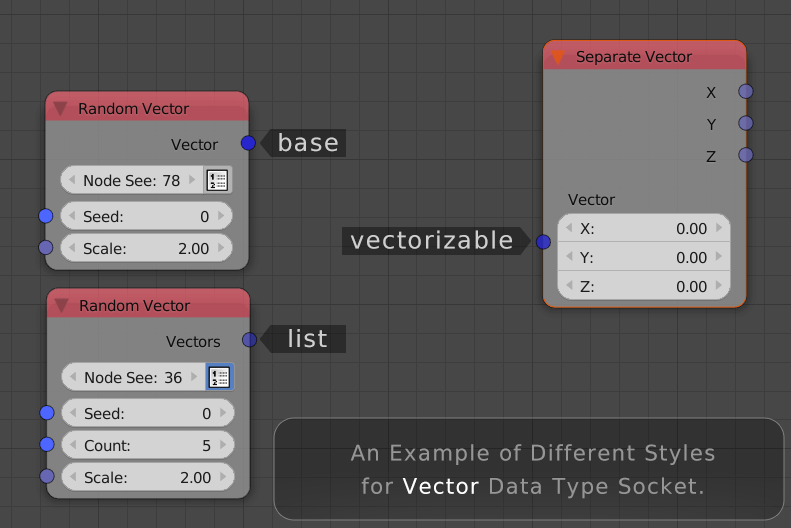

## Key Features

### Cython

Many parts of Animation Nodes has been rewritten using the Cython
programming language. It's a language that mixes Python and C and is
perfectly suited to develop addons with high performance for Blender.
There is one disadvantage though, we now have different versions of
Animation Nodes for different platforms. So you have to download the
correct version for your platform.



Subsequently, generating vectors is now 400x faster compared to non
cythonized versions. Maths is also 200x faster.

### Vectorization

Lists are an essential part of Animation Nodes. In previous versions the
only way to use lists effectively was to use loops. These have an
advantages as they give you a lot of flexibility. However, in many cases
the flexibility of loops are not needed. This release includes an
alternative approach to edit lists: Vectorized Nodes. A vectorized node
is a node that can work on individual values as well as on lists.
Together with Cython, this leads to big speedup for some operations.



Currently, vectorized nodes can be visually distinguished: When no links
connected, all vectorizable sockets, including input(s) and output(s),
are temporarily displayed in a color with transparency of 0.8 (while for
any `list` data type, the socket transparency is 0.5; and for any `base`
data type, the color is solid). Transparency will be shifted to 0.5 when
connecting with valid `list` data.

Not all nodes which could have this functionality have it yet.
Fortunately, vectorizing a node does not break it, so some nodes can be
vectorized after the first release of AN 2.0.

### Falloffs

While the first two key features were mainly targeted at all users of
Animation Nodes, falloffs have been designed specifically for motion
graphics designers. In general, a falloff is a function that tells an
effect how much it should influence a specific object. You can think of
it like a mask for an effect (similar on how we can use weight painting
to control the influence of some modifiers).



## Compatibility

Similar to the last releases, this release will break most existing
files in a way so that they don't work anymore in this release. This is
necessary to not slow down future development (keeping old stuff working
always means that some new features would not be possible). There might
be some files that still work in this release but you should not expect
that.

Updating files to work in this version is easy in some cases but very
difficult in others. In general I suggest to either use the old version
for old files or rebuild the node trees from scratch.

It is also possible to change existing files in a way that they
automatically load the correct version of AN when loaded. This might
also be useful when you want to render animations that use AN on a
renderfarm, basically you can put the .blend file and the addon into a
.zip file and upload it to the renderfarm (Note: this is only possible
when the renderfarm allows you to execute python scripts, sometimes you
first have to ask for permission). For more information contact me
(<mail@jlucke.com>).

## Documentation

Every node is documented in this manual now. We now start to improve the
documentation of individual nodes step by step. Every help is welcome,
mainly to make it more useful for artists.

## Changes in Detail

{}

## Support

There are a many ways to support the development of Animation Nodes.

- Create video/text/... **tutorials**. Feel free to contact me so that
  we can make your tutorials better together.
- Help with the official **documentation**. For example you can
  provide better descriptions for existing nodes or create images/gifs
  that show use cases for some nodes. Just send your results to me, I
  can insert it into the manual if you don't want to do all the
  git-stuff.
- Help me **financially**. This will become more and more important
  for me personally as I have to pay my bills and AN development takes
  a lot of time. Also this allows me to pay for the Blender Conference
  and other Blender related things. Below you will find two ways to
  donate.
- **Share, share, share**. Every day I search for new things people
  created with Animation Nodes. Everything I find motivates me to work
  on AN even more. Also it might attract new people to start using
  Animation Nodes.
- Get involved in the **development**. If you already have some
  programming experience with python I'd love to help you get started
  in developing new nodes and other features for Animation Nodes.

### Donation Links

- One time donation via Paypal: <https://www.paypal.me/jacqueslucke>
- Small recurring donation via Patreon (preferred):
  <https://www.patreon.com/jacqueslucke>
