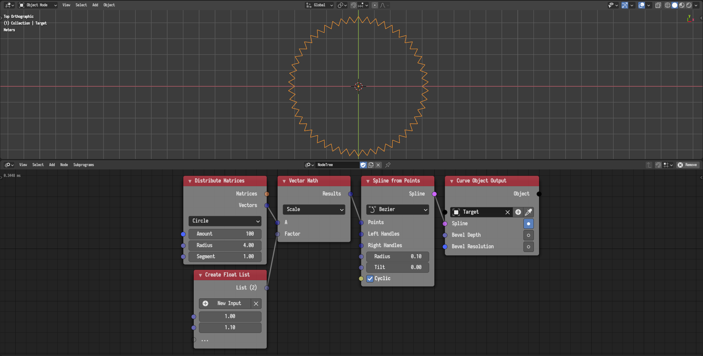

## Key Features

### Sound

The sound system was rewritten to be real-time and flexible. Baking is no
longer needed.



### Actions

Actions is a completely new system with a completely new work-flow of doing
animation in Animation Nodes. An action is an abstract representation of an
animation of a certain attribute of an object. Actions can be constructed from
Blender F-Curves or can be procedurally defined. Actions can be mixed with one
another, chained after one another, or interleaved with one another. Finally,
actions can be evaluated to transforms objects of offset transformations.

The following example illustrate the use of actions. An action is constructed
from the F-Curves of the Cube object, then its start time is delayed 5 frames
relative to the last action, finally, 10 objects are instanced and transformed
by the action with a linear offset.



### Vector Noise

Animation Nodes now support the evaluation of many types of vector noises,
including Perlin, Simplex, Value, Cubic, Voronoi, and White noises. The noises
can be evaluated directly or through other means like falloffs as illustrated
in the following example.



### LSystem



### Virtual Lists

Virtual lists are special kind of lists where the user can get the element at
any index, even if the index is out of bound or the list is empty. Virtual
lists are used internally by Animation Nodes, so users will not typically
interact with them. Many nodes utilize virtual lists to interpret input lists
of different lengths. For instance, Math nodes can now operate on lists of
different lengths, in which case, the shorter list is repeated to match the
length of the longer list. This is shown in the following example.

The usefulness of virtual lists and their repetitive behavior will become
apparent when using generator and evaluator nodes. This is shown in the
following example.



### Changes in Detail

{}

