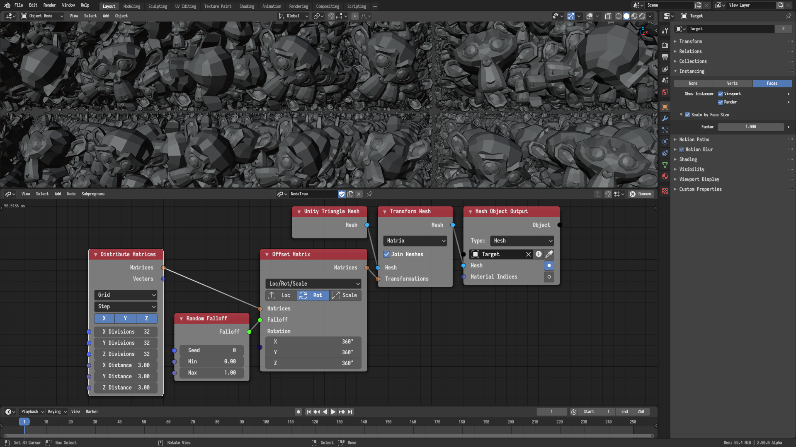
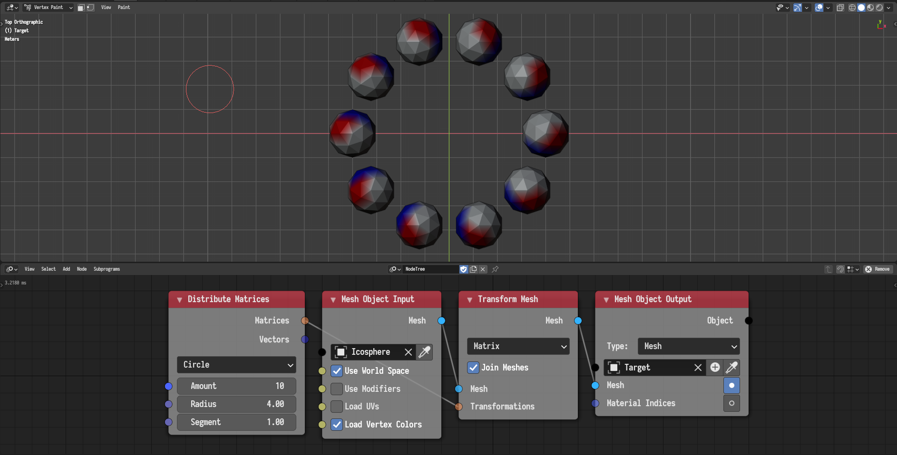
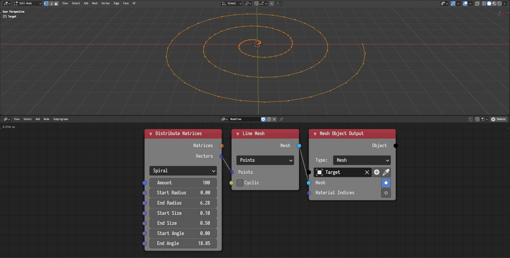
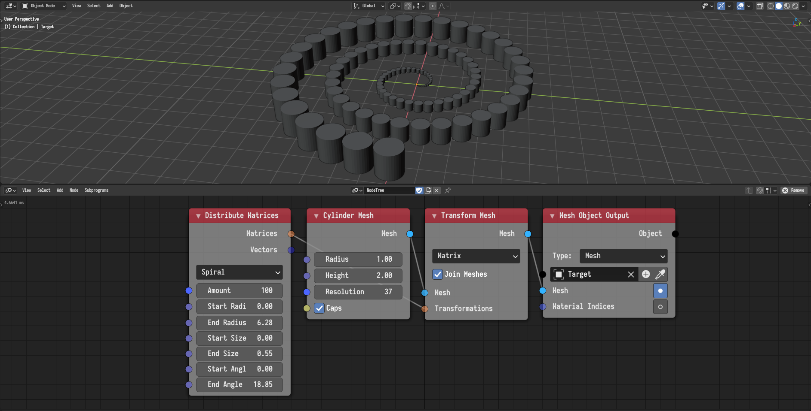
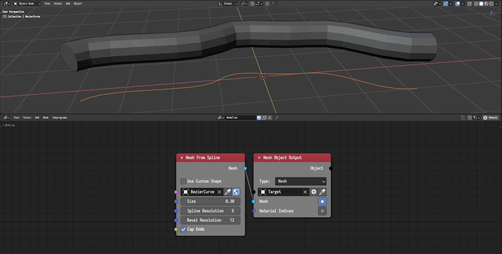
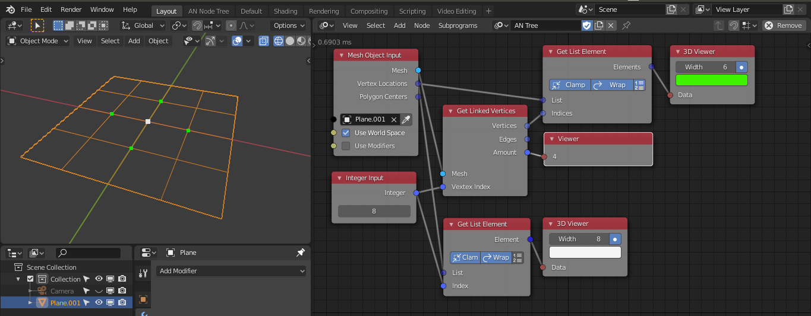
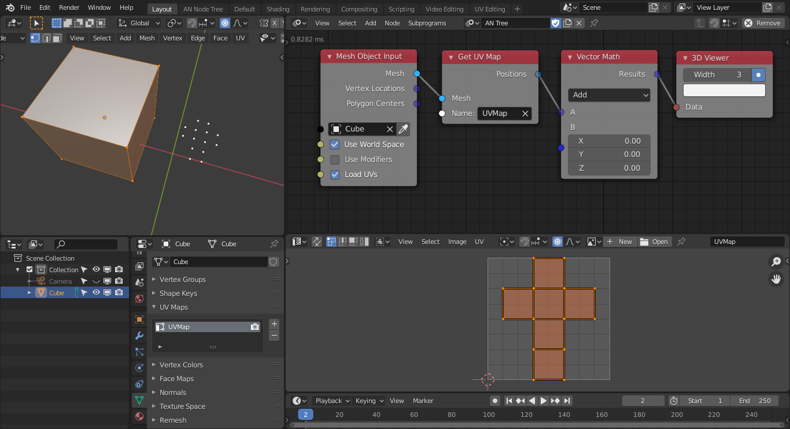

## Unity Triangle

A new *Unity Triangle* node was added. The node returns a mesh composed of a
single triangle whose area is 1, whose center is 0, and whose orientation is
such that if an object was instanced on it, the instance orientation will be 0.

This node is extremely useful if one want to instance many meshes with specific
transformations. Using the *Object Instancer* node would be very inefficient.
A more efficient approach would be to transform many unity triangles based on
the target transformations and then use Blender's face instating to instance
the target objects on that mesh. The following example illustrates this
approach.

## Combine Mesh

A new advanced node setting allows the user to skip validation.

The combine mesh node now requires edge indices to be provided when polygon
indices are provided. Edge indices can be generated from polygon indices using
the *Edges Of Polygons* node.

## Mesh Object Input

The node now allows loading UV maps and vertex color maps into meshes. The
following example illustrates the loading of vertex color maps into objects and
then writing them again after replicating the mesh.

## Mesh Info

A new *Mesh Info* node was added. It is a direct replacement for the *Separate
Mesh Data* node.

## Mesh Generators

Mesh generators now return meshes instead of the individual components.

## Line Mesh

A new *Points* mode was added in the *Line Mesh* node. It creates a line
connecting the inputs points.

## Circle Mesh

A new *Circle Mesh* node was added. The node generates a mesh or a list of
meshes representing a circle or a segment of a circle.



## Offset Polygons

This node replaces the old *Transform Polygons* node. In addition to the
standard polygon transformations that were possible before, the node now allows
custom pivots and transformation spaces. Custom pivots can be generated using
the *Extract Polygon Transforms* node.



## Extract Polygon Transforms

The node now supports more modes of operation. In particular, the
transformations can now be alighted with edges based on their distance to a
certain point or their direction.



## Transform Mesh

A new *Transform Mesh* node was added. It replaces the *Replicate Mesh* node
and also provide functionalities to transform a list of objects using virtual
lists.

## Mesh From Spline

A new *Mesh From Spline* node was added. The node converts a spline into a mesh
with possibly a custom profile.

## Prepare Polygon Transforms

This node was removed. Replaced by the *Extract Polygon Transforms* and the
*Polygon Offset* node.

## Separate Mesh Data

This node was removed. Replaced by the *Mesh Info* node.

## Mesh Data From Object

This node was removed. Replaced by the *Mesh Object Input* node.

## Object Mesh Data

This node was removed. Replaced by the *Mesh Object Input* node.

## Replicate Mesh

This node was removed. Replaced by the *Transform Mesh* node.

## Set Vertex Weight

A new *Set Vertex Weight* node was added. This node allows to set weight for each vertex of an object.



## Triangulate Mesh

A new *Triangulate Mesh* node was added. This node allows to triangulate a mesh with *Fan Span* or
*Ear Clip* method.

## Get Linked Vertices

A new *Get Linked Vertices* node was added. This node gives information about the vertices (and edges)
that are linked to a vertex.

## Mesh Points Scatter

A new *Mesh Points Scatter* node was added. This node allows to scatter random points on a mesh based
on the weight. This node is really helpful for scattering objects on mesh surface e.g., trees on a terrain.



## Line Mesh

This node now has two modes *Start-End* and *Points* to generate line mesh.

## Vertex Color

New nodes added to get or set vertex colors with different modes. There are three nodes for that *Get Vertex Color Layer*, *Insert Vertex Color Layer*, and *Set Vertex Color*.



## Bevel Weight

The *Set Bevel Vertex Weight* and *Set Bevel Edge Weight* nodes added to set bevel weight for vertices
and edges of an object.



## Set Edge Crease

A new *Set Edge Crease* node added. This allows to set crease of edges which can be utilized with modifiers.

## UV Map

New nodes added to get or set uv-maps. There are three nodes for that *Get UV Map Layer*, *Insert UV Map Layer*, and *Set UV Map*.

## Set Polygon Material Index

A new *Set Polygon Material Index* node added. This node allows to set material index for each polygon.
So one can assign different materials to different regions of an object.
